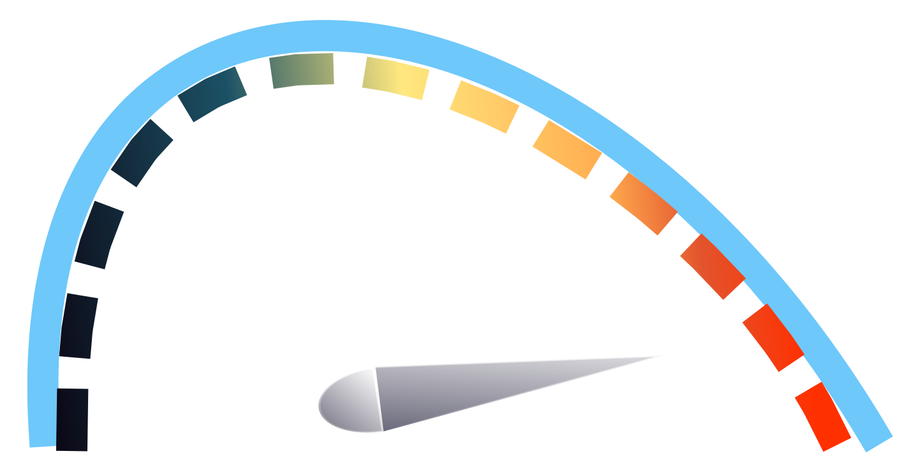

<!-- PROJECT SHIELDS -->
<!--
*** I'm using markdown "reference style" links for readability.
*** Reference links are enclosed in brackets [ ] instead of parentheses ( ).
*** See the bottom of this document for the declaration of the reference variables
*** for build-url, contributors-url, etc. This is an optional, concise syntax you may use.
*** https://www.markdownguide.org/basic-syntax/#reference-style-links
-->
[![Build Status][build-shield]][build-url]
[![Contributors][contributors-shield]][contributors-url]
[![MIT License][license-shield]][license-url]
[![LinkedIn][linkedin-shield]][linkedin-url]


<!-- PROJECT LOGO -->
<br />
<p align="center">
  <a href="https://github.com/gilbo123/BackgroundSpeedTest">
    
  </a>

  <h3 align="center">Background Speed Test Server</h3>

  <p align="center">
    A simple server that runs in the background every 5 mins to test your internet speed and displays the results in a graph.
    <br />
    <a href="https://github.com/gilbo123/BackgroundSpeedTest"><strong>Explore the docs »</strong></a>
    <br />
    <br />
    <a href="https://github.com/gilbo123/BackgroundSpeedTest">View Demo</a>
    ·
    <a href="https://github.com/gilbo123/BackgroundSpeedTest/issues">Report Bug</a>
    ·
    <a href="https://github.com/gilbo123/BackgroundSpeedTest/issues">Request Feature</a>
  </p>
</p>


<!-- TABLE OF CONTENTS -->
## Table of Contents

* [About the Project](#about-the-project)
  * [Built With](#built-with)
* [Getting Started](#getting-started)
  * [Prerequisites](#prerequisites)
  * [Installation](#installation)
* [Usage](#usage)
* [Contributing](#contributing)
* [License](#license)
* [Contact](#contact)


<!-- ABOUT THE PROJECT -->
## About The Project

[![Graph example][product-screenshot]](https://example.com)

This project generates a continous timed event where Speedtest (CLI version) is used to gather download and upload information. The reults are saved to and retrieved from a mongodb database before being plotted on a FastApi endpoint. The program will automatically delete old data from the same file.

Features:
* Lightweight storage (text file) - no databases.
* Responsive rea-time graphical display of data.
* Adjustable period and frequency.

### Built With

Frameworks used in the application:

* [![Python][python-shield]](https://www.python.org/)
* [![FastAPI][fastapi-shield]](http://fastapi.tiangolo.com/)
* [![HTML][html-shield]](https://html.com/)
* [![JavaScript][js-shield]](https://www.javascript.com/)
* [![ChartJS][chartjs-shield]](https://www.chartjs.org/)
* [![Jinja][jinja-shield]](https://jinja.palletsprojects.com/en/3.1.x/)


<!-- GETTING STARTED -->
## Getting Started

This application is inteded to run on a server such as a Raspberry Pi or other local server attached to your modem or router by ethernet cable to get the best results.

### Prerequisites

* Python3
* npm (Node Package Manager)


#### npm (Node Package Manager)
pip3 install npm
```
or for Raspberry Pi:
```sh
sudo apt-get install npm
```

### Installation

1. Chart.js (JavaScript library for displaying graphs)
```sh
npm install chart.js
```

2. Official Speedtest CLI - https://www.speedtest.net/apps/cli
```sh
sudo apt-get install curl
curl -s https://packagecloud.io/install/repositories/ookla/speedtest-cli/script.deb.sh | sudo bash
sudo apt-get install speedtest
```

__Note: The speedtest CLI will need to be run at least once in the shell before using the server due to licensing agreement.__
```sh
speedtest
```

3. Clone the repo
```sh
git clone https://github.com/gilbo123/BackgroundSpeedTest.git
```
```sh
cd BackGroundSpeedTest
```
4. Install requirements
```sh
pip3 install -r requirements.txt
```

<!-- USAGE EXAMPLES -->
## Usage

```sh
bash run_server.sh
```

## View the dashboard

Open a web browser and navigate to the following URL on the machine running the server:
```sh
http://localhost:5500
```

__Note: The default port is 5500. If you have changed the port in the config.yaml file, you will need to use the port number you set.__ 

To access the dashboard from another device on the same network, use the following URL:__
```sh
http://<server_ip>:5500
```


_For more examples, please refer to the [Documentation](https://example.com)_


<!-- CONTRIBUTING -->
## Contributing

Contributions are what make the open source community such an amazing place to be learn, inspire, and create. Any contributions you make are **greatly appreciated**.

1. Fork the Project
2. Create your Feature Branch (`git checkout -b feature/AmazingFeature`)
3. Commit your Changes (`git commit -m 'Add some AmazingFeature'`)
4. Push to the Branch (`git push origin feature/AmazingFeature`)
5. Open a Pull Request


<!-- LICENSE -->
## License

Distributed under the MIT License. See `LICENSE` for more information.


<!-- CONTACT -->
## Contact

Gilbert Eaton - [@mechatronicdoc](https://x.com/mechatronicdoc) - gilberteaton@gmail.com

Project Link: [https://github.com/gilbo123/BackgroundSpeedTest](https://github.com/gilbo123/BackgroundSpeedTest)


<!-- MARKDOWN LINKS & IMAGES -->
<!-- https://www.markdownguide.org/basic-syntax/#reference-style-links -->
[build-shield]: https://img.shields.io/badge/build-passing-brightgreen.svg?style=flat-square
[build-url]: #
[contributors-shield]: https://img.shields.io/github/contributors/gilbo123/BackgroundSpeedTest.svg?style=flat-square
[contributors-url]: https://github.com/gilbo123/BackgroundSpeedTest/graphs/contributors
[license-shield]: https://img.shields.io/badge/license-MIT-blue.svg?style=flat-square
[license-url]: https://github.com/gilbo123/BackgroundSpeedTest/blob/master/LICENSE.txt
[linkedin-shield]: https://img.shields.io/badge/-LinkedIn-black.svg?style=flat-square&logo=linkedin&colorB=555
[linkedin-url]: https://linkedin.com
[product-screenshot]: web/static/images/graph.png
[fastapi-shield]: https://img.shields.io/badge/FastAPI-005571?style=for-the-badge&logo=fastapi
[chartjs-shield]: https://img.shields.io/badge/Chart.js-FF6384?style=for-the-badge&logo=chartdotjs&logoColor=white
[html-shield]: https://img.shields.io/badge/HTML-239120?style=for-the-badge&logo=html5&logoColor=white
[css-shield]: https://img.shields.io/badge/CSS-239120?&style=for-the-badge&logo=css3&logoColor=white
[js-shield]: https://img.shields.io/badge/JavaScript-F7DF1E?style=for-the-badge&logo=javascript&logoColor=black
[python-shield]: https://img.shields.io/badge/Python-14354C?style=for-the-badge&logo=python&logoColor=white
[jinja-shield]: https://img.shields.io/badge/Jinja-B41717?logo=jinja&logoColor=fff&style=for-the-badge
