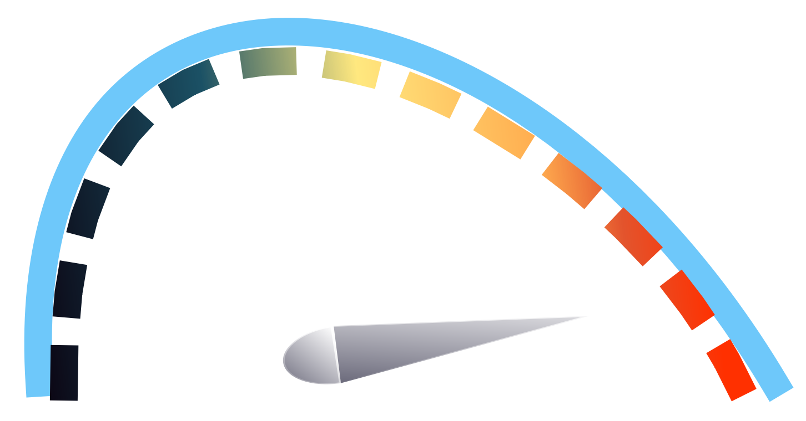

<!-- PROJECT SHIELDS -->
<!--
*** I'm using markdown "reference style" links for readability.
*** Reference links are enclosed in brackets [ ] instead of parentheses ( ).
*** This is an optional, concise syntax you may use.
*** https://www.markdownguide.org/basic-syntax/#reference-style-links
-->
[![Build Status][build-shield]][build-url]
[![MIT License][license-shield]][license-url]
[![Python 3.9+][python-shield]][python-url]
[![MongoDB][mongo-shield]][mongo-url]
[![FastAPI][fastapi-shield]][fastapi-url]


<!-- PROJECT LOGO -->
<br />
<p align="center">
  <a href="https://github.com/gilbo123/BackgroundSpeedTest">
    
  </a>

  <h3 align="center">Background Speed Test</h3>

  <p align="center">
    A lightweight background service that runs periodic speed tests and displays the results on a real-time dashboard.
    <br />
    <br />
    <a href="https://github.com/gilbo123/BackgroundSpeedTest"><strong>Explore the docs »</strong></a>
    <br /><br />
    <a href="https://github.com/gilbo123/BackgroundSpeedTest/issues">Report Bug</a>
    ·
    <a href="https://github.com/gilbo123/BackgroundSpeedTest/issues">Request Feature</a>
  </p>
</p>


<!-- TABLE OF CONTENTS -->
<details>
  <summary>Table of Contents</summary>

- [About](#about-the-project)
  - [Features](#features)
  - [Built with](#built-with)
- [Getting started](#getting-started)
  - [Prerequisites](#prerequisites)
  - [Installation](#installation)
  - [Configuration](#configuration)
- [Usage](#usage)
  - [Run the server](#run-the-server)
  - [Dashboard views](#dashboard-views)
  - [API endpoints](#api-endpoints)
  - [Production (systemd)](#production-systemd)
- [Contributing](#contributing)
- [License](#license)
- [Contact](#contact)
</details>


<!-- ABOUT THE PROJECT -->
## About The Project

[![Dashboard screenshot][product-screenshot]](https://github.com/gilbo123/BackgroundSpeedTest)

Background Speed Test runs the [Ookla Speedtest CLI](https://www.speedtest.net/apps/cli) in the background at a fixed interval, stores each result in MongoDB, and exposes an interactive web dashboard so you can see how your connection performs over time.

### Features

- **Continuous monitoring** – speed tests run automatically every N seconds (configurable).
- **Real-time dashboard** – stat cards (download / upload / ping / last test) plus a Chart.js line graph, auto-refreshing every 60 s without a page reload.
- **Four time ranges** – Day (24 h), Week (7 d), Month (30 d), Year (up to `keep_records_for` days), each with a date format tailored to that view.
- **Lightweight stack** – a single FastAPI server, Jinja templates, vanilla JS + Chart.js (no build step, no CDN).
- **Self-cleaning storage** – records older than `keep_records_for` days are deleted automatically by the background thread.
- **Production-ready** – ships with a systemd unit for Raspberry Pi / headless Linux hosts.

### Built with

* [![Python][python-shield]][python-url]
* [![FastAPI][fastapi-shield]][fastapi-url]
* [![MongoDB][mongo-shield]][mongo-url]
* [![HTML][html-shield]][html-url]
* [![JavaScript][js-shield]][js-url]
* [![Chart.js][chartjs-shield]][chartjs-url]
* [![Jinja][jinja-shield]][jinja-url]


<!-- GETTING STARTED -->
## Getting Started

> **Tip** – For the most stable readings, connect the test host to your router by **Ethernet** and run it on a small always-on box (Raspberry Pi, VPS, home server, …). A Wi-Fi client will show extra variance that's more about RF conditions than your ISP.

### Prerequisites

| Requirement | Version | Notes |
|------------|---------|-------|
| Python | ≥ 3.9 | Tested on 3.9–3.12 |
| MongoDB | ≥ 4.4 | Local instance (`mongodb://localhost:27017`) |
| pip packages | — | Installed from `requirements.txt` (includes `speedtest-cli`) |

No Node.js or browser build tools are needed — Chart.js is bundled (`web/static/js/chart.umd.js`).

### Installation

1. **Install MongoDB** *(if you haven't already)*
```sh
# Debian / Ubuntu
sudo apt-get install -y mongodb-org    # or: apt-get install mongod

# macOS (Homebrew)
brew install mongodb-community
brew services start mongodb-community
```

2. **Clone the repo**
```sh
git clone https://github.com/gilbo123/BackgroundSpeedTest.git
cd BackgroundSpeedTest
```

3. **Create a virtualenv and install deps**
```sh
python3 -m venv .venv
source .venv/bin/activate
pip install -r requirements.txt
```

4. **Accept the Speedtest CLI licence** (one-time)
```sh
python -m speedtest
```
The first run prints Ookla's EULA; press **Enter** to accept.

### Configuration

All tunables live in `config.yaml` at the project root:

```yaml
# Window shown on the dashboard (used as the default "Month" view)
days: 20                # → 20 days

# Retention: records older than N days are deleted by the background thread
keep_records_for: 180   # → 6 months of data kept

# Interval between speed tests in seconds
test_interval: 300      # 300 = 5 min; 3600 = 1 h

# Bind port for the dashboard + API
port: 5500
```

| Key | Description | Default |
|-----|-------------|---------|
| `days` | Default window for the **Month** view (also used when `?view=` is omitted) | 20 |
| `keep_records_for` | How many days of records to retain; anything older is pruned | 180 |
| `test_interval` | Seconds between automatic speed tests | 300 |
| `port` | HTTP listen port | 5500 |

> **Headline note** – The "Year" view is capped at `keep_records_for`. If you want 12 months of history, set `keep_records_for` to at least **366**.

<!-- USAGE EXAMPLES -->
## Usage

### Run the server

```sh
source .venv/bin/activate          # if not already active
bash run_server.sh                 # or: python web/server.py
```

Uvicorn will bind to `0.0.0.0:5500` (override via `port:` in `config.yaml`).

### View the dashboard

Open `http://localhost:5500` in any browser.

From another device on the same LAN, replace `localhost` with the server's IP:
```
http://192.168.1.42:5500
```

### Dashboard views

The chart header includes a **Day / Week / Month / Year** toggle that changes the visible time window and the x-axis label format:

| View  | Window                       | Example tick label |
|-------|------------------------------|--------------------|
| Day   | 24 h                         | `10 Sep, 14:25`    |
| Week  | 7 d                          | `Thu 10`           |
| Month | 30 d                         | `10 Sep`           |
| Year  | up to `keep_records_for` d   | `Sep 26`           |

The chosen view is stored in `localStorage` and restored on the next page load.

### API endpoints

| Endpoint       | Description |
|----------------|-------------|
| `GET /`        | Renders the dashboard (Jinja template). |
| `GET /api/data`| JSON payload for the chart. Accepts `?view=day\|week\|month\|year` or an explicit `?days=N`. |
| `GET /health`  | Liveness: Mongo ping, test-thread status, uptime. |

**`/api/data` response shape**
```json
{
  "dates": ["10 Sep, 14:25", "10 Sep, 14:30"],
  "ts": [1757500000, 1757500500],
  "downloads": [334.0, 310.2],
  "uploads": [82.8, 79.1],
  "pings": [7.4, 8.1],
  "downloads_units": "Mbps",
  "uploads_units": "Mbps",
  "pings_units": "ms",
  "days": 30,
  "view": "month",
  "last_test": {
    "date": "10 Sep",
    "download": 334.0,
    "upload": 82.8,
    "ping": 7.4,
    "time": "10 Sep 2026, 14:30",
    "ts": 1757500500
  }
}
```

### Production (systemd)

A ready-made unit file is included at [`web/backend-speedtest.service`](web/backend-speedtest.service).

```sh
# 1. Copy to the system (adjust User / WorkingDirectory / ExecStart to match your setup)
sudo cp web/backend-speedtest.service /etc/systemd/system/

# 2. Point ExecStart at your venv's python
#    ExecStart=/opt/backgroundspeedtest/.venv/bin/python web/server.py

# 3. Reload & enable
sudo systemctl daemon-reload
sudo systemctl enable --now backend-speedtest

# 4. Check status / logs
sudo systemctl status backend-speedtest
journalctl -u backend-speedtest -f
```

The unit uses `After=mongod.service` so the test runner waits for MongoDB before starting.


<!-- CONTRIBUTING -->
## Contributing

Contributions are what make the open source community such an amazing place to learn, inspire, and create. Any contributions you make are **greatly appreciated**.

1. Fork the Project
2. Create a Feature Branch (`git checkout -b feature/AmazingFeature`)
3. Commit your changes (`git commit -m 'feat: add AmazingFeature'`)
4. Push to the Branch (`git push origin feature/AmazingFeature`)
5. Open a Pull Request


<!-- LICENSE -->
## License

Distributed under the MIT License. See the `LICENSE` file for more information.


<!-- CONTACT -->
## Contact

Gilbert Eaton - [@mechatronicdoc](https://x.com/mechatronicdoc) - gilberteaton@gmail.com

Project link: [https://github.com/gilbo123/BackgroundSpeedTest](https://github.com/gilbo123/BackgroundSpeedTest)


<!-- MARKDOWN LINKS & IMAGES -->
<!-- https://www.markdownguide.org/basic-syntax/#reference-style-links -->
[build-shield]: https://img.shields.io/badge/build-passing-brightgreen.svg?style=flat-square
[build-url]: #
[license-shield]: https://img.shields.io/badge/license-MIT-blue.svg?style=flat-square
[license-url]: https://github.com/gilbo123/BackgroundSpeedTest/blob/master/LICENSE
[python-shield]: https://img.shields.io/badge/Python-3776AB?style=flat-square&logo=python&logoColor=white
[python-url]: https://www.python.org/
[mongo-shield]: https://img.shields.io/badge/MongoDB-47A248?style=flat-square&logo=mongodb&logoColor=white
[mongo-url]: https://www.mongodb.com/
[fastapi-shield]: https://img.shields.io/badge/FastAPI-005571?style=flat-square&logo=fastapi&logoColor=white
[fastapi-url]: https://fastapi.tiangolo.com/
[html-shield]: https://img.shields.io/badge/HTML-239120?style=flat-square&logo=html5&logoColor=white
[html-url]: https://html.com/
[js-shield]: https://img.shields.io/badge/JavaScript-F7DF1E?style=flat-square&logo=javascript&logoColor=black
[js-url]: https://www.javascript.com/
[chartjs-shield]: https://img.shields.io/badge/Chart.js-FF6384?style=flat-square&logo=chartdotjs&logoColor=white
[chartjs-url]: https://www.chartjs.org/
[jinja-shield]: https://img.shields.io/badge/Jinja2-EEA365?style=flat-square&logo=jinja&logoColor=white
[jinja-url]: https://jinja.palletsprojects.com/
[product-screenshot]: web/static/images/graph.png
